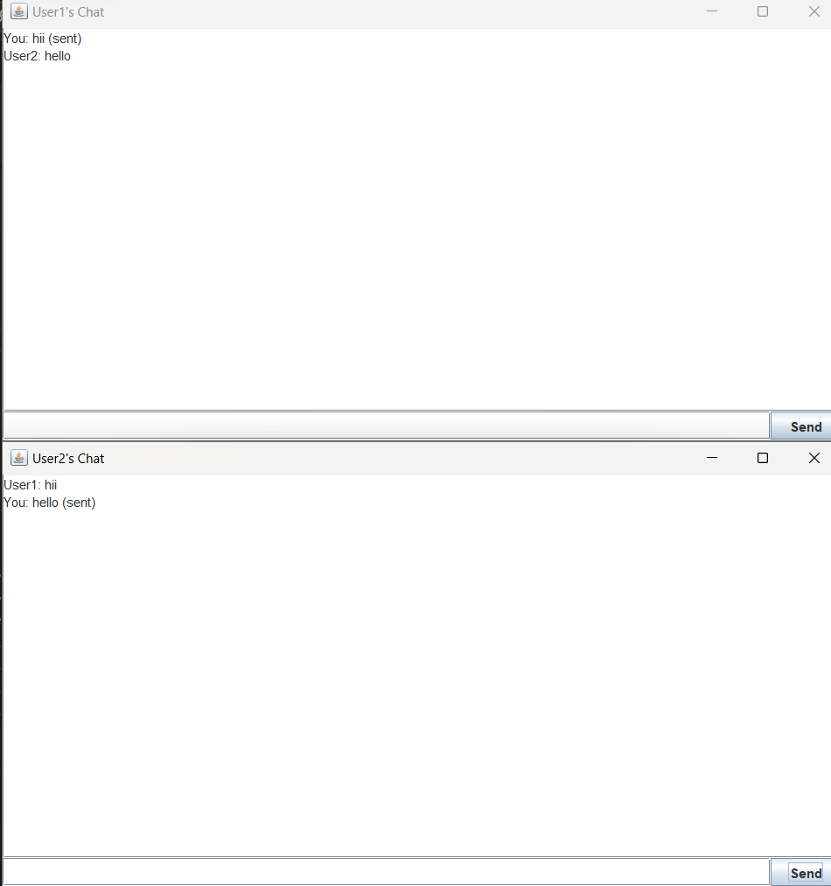

# 💬 Java Chat Application

This is a basic **multi-client chat application** built using **Java Sockets** and **Swing GUI**. It allows multiple users to connect to a common server and chat in real time via a simple graphical interface.

---

## 🚀 Features

- 🔗 Server-Client Communication using `Socket` and `ServerSocket`
- 🧵 Multi-threaded Server for handling multiple clients simultaneously
- 🪟 User-friendly GUI using `Swing`
- 💬 Real-time message broadcasting
- 🔒 Graceful disconnect support

---

## 🛠️ Technologies Used

- Java SE
- Java Swing for GUI
- Java IO and Networking libraries

---

## ▶️ How to Run

### 🖥️ Start the Server

```bash
javac Server.java
java Server
```

## You’ll see:

```arduino
Server started. Waiting for clients to connect...
```
👥 Start the Clients  
Open another terminal window for each client:

```bash
javac ClientGUI.java
java ClientGUI
```
Each client window will launch with a text area and a message box to chat.

---

## 🔧 How It Works

**Server**
- Accepts multiple client connections
- Creates a new thread (`ClientHandler`) for each client
- Broadcasts messages to all other connected clients

**Client**
- Connects to the server via socket
- Uses GUI to send/receive messages
- Handles message display and user interface

---

## 📸 Sample Output

✅ **Server Console**
```arduino
Server started. Waiting for clients to connect...
Client connected: /127.0.0.1
```

✅ **Chat Window**
```makefile
User1: Hello!
User2: Hi there!
You: Hello! (sent)
```


---

## 🏁 Future Enhancements

✅ Add login with usernames

🔒 Encrypt messages for privacy

🎨 Improve chat UI design

💬 Add emojis and file transfer support


